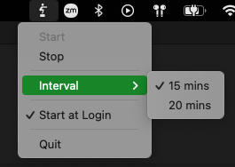
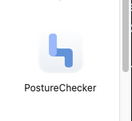
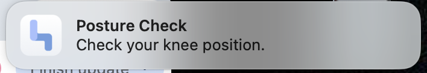

# PostureChecker

A lightweight macOS menu bar app that reminds you to check your posture at regular intervals.

## Screenshot

## Features

- Runs as a menu bar app (no Dock icon)
- Start / Stop posture reminders
- Select reminder interval (15 or 20 minutes)
- Native macOS notifications
- Optional launch at login
- Minimal, distraction-free design

## Why I Built This

After spending long periods sitting at a desk, I wanted a simple reminder to check my posture—specifically knee and leg position—without using a heavy or distracting application.

This project was also an opportunity to learn native macOS development using Swift and SwiftUI.

## Tech Stack

- Swift
- SwiftUI
- AppKit (menu bar integration)
- UserNotifications (system notifications)
- ServiceManagement (launch at login)

## How It Works

- The app runs in the macOS menu bar using `MenuBarExtra`
- A timer triggers at the selected interval
- Each interval sends a native macOS notification
- The interval can be changed dynamically while running
- Login behavior is managed using `SMAppService`

## Running the App

1. Clone the repository
2. Open in Xcode
3. Build and run

To use outside Xcode:
- Build the app
- Copy `PostureChecker.app` from the build folder into `/Applications`
- Launch it like a normal macOS app

## Future Improvements

- Custom menu bar icon states (running vs stopped)
- Adjustable intervals
- Quiet hours / schedule
- Snooze functionality

## Author

Chance Harmon